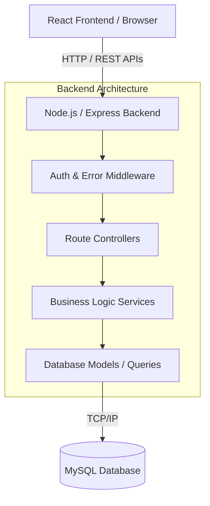
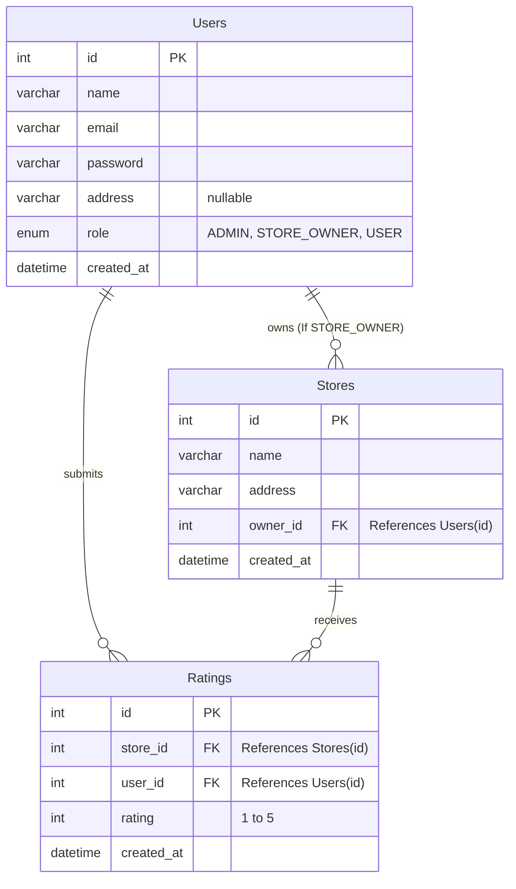
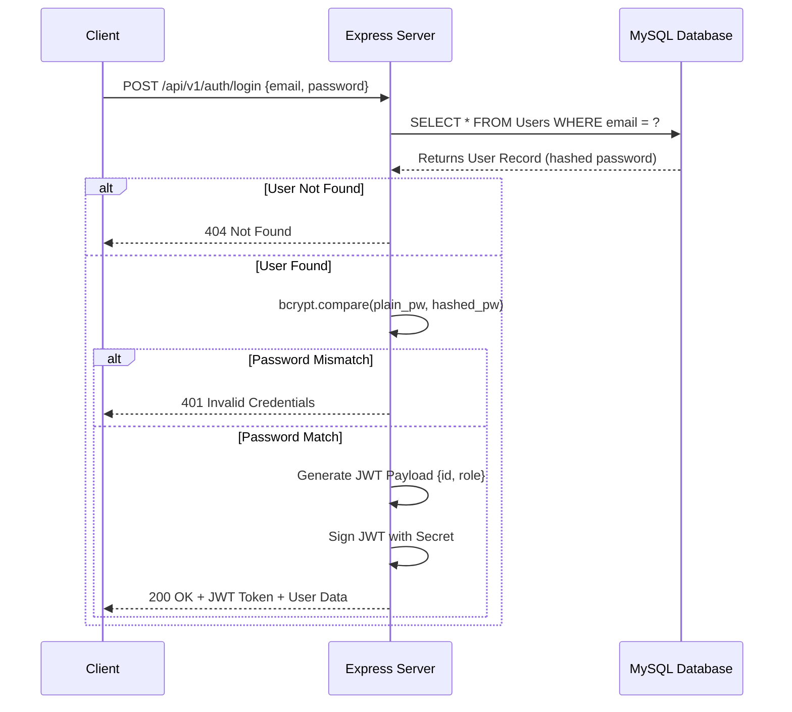
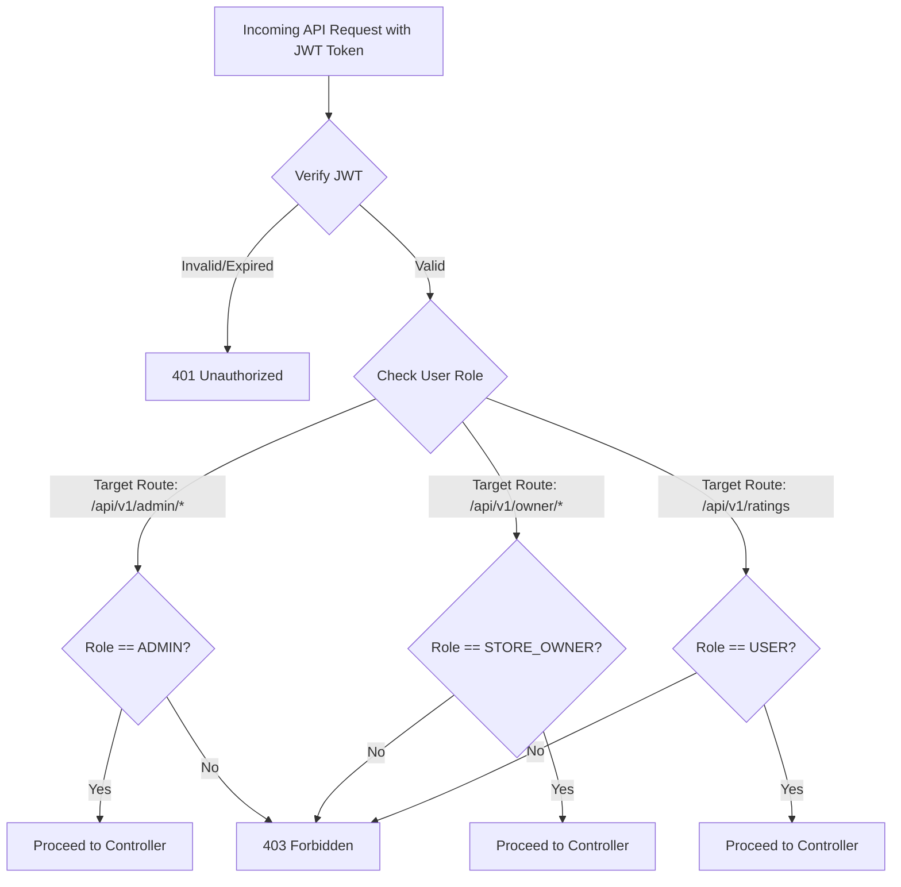

# System Architecture

## 1. High-Level Architecture Diagram

```mermaid
graph TD
    Client[React Frontend / Browser] --> |HTTP / REST APIs| Server[Node.js / Express Backend]
    
    subgraph Backend Architecture
        Server --> Middleware[Auth & Error Middleware]
        Middleware --> Controllers[Route Controllers]
        Controllers --> Services[Business Logic Services]
        Services --> Models[Database Models / Queries]
    end
    
    Models --> |TCP/IP| DB[(MySQL Database)]
```

## 2. Database ER Diagram

```mermaid
erDiagram
    Users {
        int id PK
        varchar name
        varchar email
        varchar password
        varchar address "nullable"
        enum role "ADMIN, STORE_OWNER, USER"
        datetime created_at
    }
    
    Stores {
        int id PK
        varchar name
        varchar address
        int owner_id FK "References Users(id)"
        datetime created_at
    }
    
    Ratings {
        int id PK
        int store_id FK "References Stores(id)"
        int user_id FK "References Users(id)"
        int rating "1 to 5"
        datetime created_at
    }

    Users ||--o{ Stores : "owns (If STORE_OWNER)"
    Users ||--o{ Ratings : "submits"
    Stores ||--o{ Ratings : "receives"
```

## 3. Authentication Flow Diagram

```mermaid
sequenceDiagram
    participant User as Client
    participant API as Express Server
    participant DB as MySQL Database

    User->>API: POST /api/v1/auth/login {email, password}
    API->>DB: SELECT * FROM Users WHERE email = ?
    DB-->>API: Returns User Record (hashed password)
    
    alt User Not Found
        API-->>User: 404 Not Found
    else User Found
        API->>API: bcrypt.compare(plain_pw, hashed_pw)
        alt Password Mismatch
            API-->>User: 401 Invalid Credentials
        else Password Match
            API->>API: Generate JWT Payload {id, role}
            API->>API: Sign JWT with Secret
            API-->>User: 200 OK + JWT Token + User Data
        end
    end
```

## 4. Role-Based Access Control (RBAC) Flow

```mermaid
flowchart TD
    Request[Incoming API Request with JWT Token] --> AuthMiddleware{Verify JWT}
    AuthMiddleware -- Invalid/Expired --> 401[401 Unauthorized]
    AuthMiddleware -- Valid --> RoleCheck{Check User Role}
    
    RoleCheck -- Target Route: /api/v1/admin/* --> IsAdmin{Role == ADMIN?}
    IsAdmin -- Yes --> AllowAdmin[Proceed to Controller]
    IsAdmin -- No --> 403[403 Forbidden]
    
    RoleCheck -- Target Route: /api/v1/owner/* --> IsOwner{Role == STORE_OWNER?}
    IsOwner -- Yes --> AllowOwner[Proceed to Controller]
    IsOwner -- No --> 403
    
    RoleCheck -- Target Route: /api/v1/ratings --> IsUser{Role == USER?}
    IsUser -- Yes --> AllowUser[Proceed to Controller]
    IsUser -- No --> 403
```
